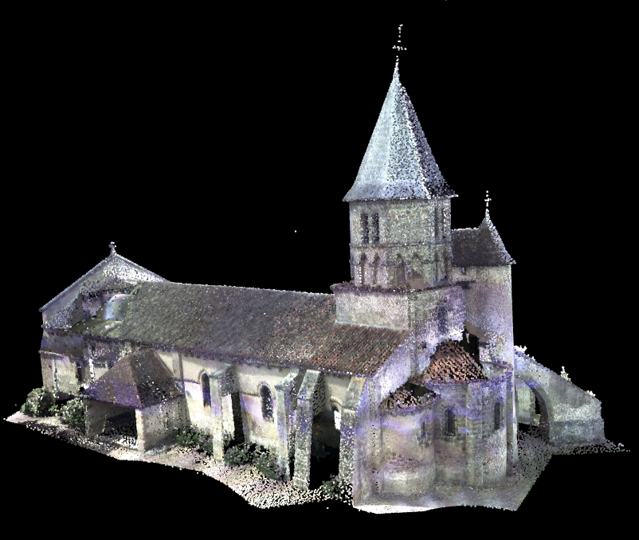
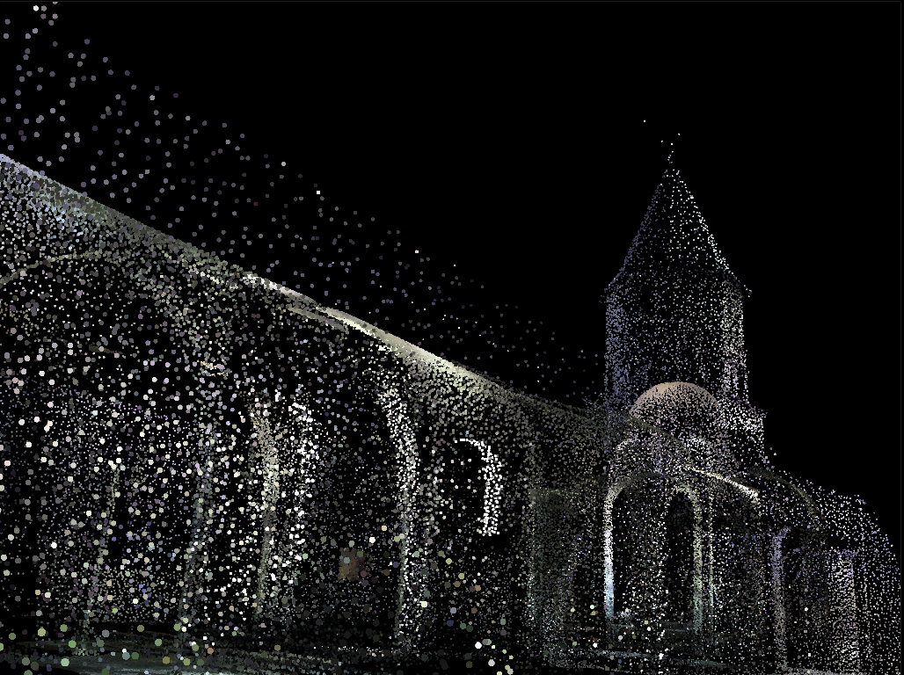
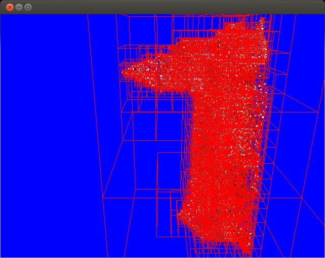

PointMan-Renderer
=================

A WebGL point cloud renderer (with Octree construction and traversal) by Nathan Marshak and Uriah Baalke. 

[See slides about PointMan on Google Docs, for more info.](https://docs.google.com/presentation/d/1toQ5c5Mw_8D_hWouQqrb1SKOvAJjrxdFCHs503GID20/edit?usp=sharing)

Below, a medium res render of the church sent from the client:

Below, a low-res render of the church as seen from the client:

Below, the octree as seen from the server (the church is sideways in this picture):

FUTURE WORK: Traverse the octree in a "smart" way that takes the view into account, rather than just pulling it "progressively". 

##Usage:

In terminal:
  * $ python server/pointcloud_server.py

Then start html application.

Controls:
* Click and drag mouse to look.
* WASD to fly.
* Q and E to roll.
  
Credits
=================
* Some base code from the [CIS565 WebGL assignment](https://github.com/CIS565-Fall-2013).
* Trick for drawing circular points from [Movania Muhammad Mobeen](http://mmmovania.blogspot.com/2010/12/circular-point-sprites-in-opengl-33.html).
* Octree based on notes from http://www.brandonpelfrey.com/blog/coding-a-simple-octree/
* Server-side visualizer based on "OpenGL GLUT Shapes" sample from http://openglsamples.sourceforge.net/
